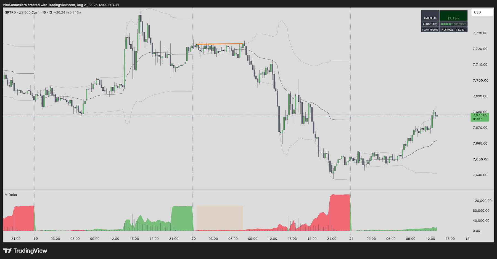
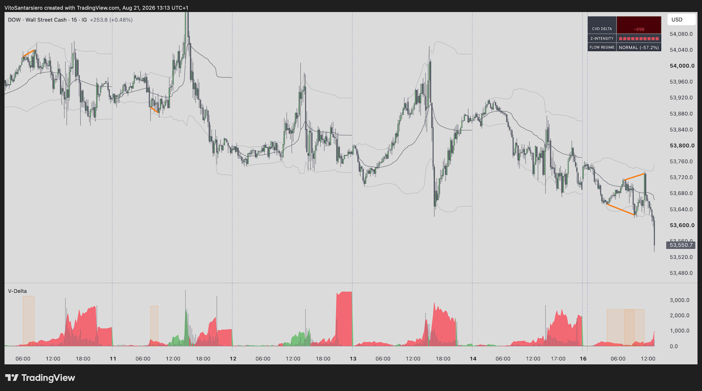
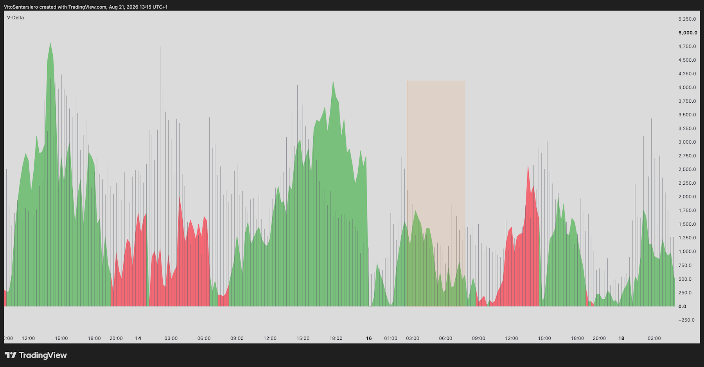

# V-Cumulative Delta — Order Flow Regime & Divergence Engine

**Pine Script v6 | TradingView | Public Release 2026 — Protected Source Code**

Cumulative Volume Delta (CVD) engine that classifies real-time order-flow behaviour into distinct regimes and flags statistically significant divergences between price and delta, anchored to a live VWAP with deviation bands.

Built and used daily in live trading. Part of the V-Suite — works best combined with the [V-Profile Matrix](https://github.com/VTS92/V-Profile-Matrix-for-TradingView) and the [V-Sessions](https://github.com/VTS92/V-Sessions-for-TradingView).

---

## What it does

**Cumulative Delta Tracking**
- Configurable CVD calculation mode — resets on a chosen timeframe, runs as a single session, or accumulates continuously
- Delta is derived from lower-timeframe up/down volume, giving a more precise buy/sell split than bar-close direction alone

**Order Flow Regime Classification**
- Combines delta efficiency (delta as a % of total volume) with a rolling Z-score of the CVD change to classify the current bar into one of three regimes:
  - **NORMAL** — balanced execution, price follows delta
  - **ICEBERG** — limit absorption (high delta efficiency, low Z-score) — large passive orders soaking up aggression without moving price
  - **EXHAUST** — order exhaustion/reversal risk (low delta efficiency, high Z-score) — aggressive volume with diminishing price effect

**Divergence Detection**
- Regular and hidden divergence detection between price pivots and cumulative delta, with configurable display mode
- Divergences are marked directly on the chart with connecting lines and highlighted zones

**VWAP Anchor & Deviation Suite**
- Anchored VWAP (Daily / Week / Month / Year) with up to 3 configurable standard-deviation bands

**Live Dashboard**
- On-chart table summarising the current CVD value, a visual Z-score intensity bar, and the active order-flow regime with its delta efficiency reading

---

## Screenshots

*(coming soon — updated for the v6 release)*

---

## Access

This repository documents the design and functionality of V-Cumulative Delta as part of a professional portfolio. The source code is **not distributed in this repository** — the script is published and maintained as a protected (closed-source) invite-only script on TradingView.

For access or a walkthrough of the implementation, please get in touch via [LinkedIn](https://linkedin.com/in/vito-santarsiero).

---

## Part of the V-Suite

- **[V-Profile Matrix](https://github.com/VTS92/V-Profile-Matrix-for-TradingView)** — session-anchored volume profile with ATR-filtered Fair Value Gap detection and Power Score
- **[V-Sessions](https://github.com/VTS92/V-Sessions-for-TradingView)** — multi-session mapping with per-session POC, LVN and mitigation tracking

**How they fit together:** V-Session tells you *when* each market was active. V-Profile Matrix tells you *where* volume is concentrated. V-Cumulative Delta tells you *who* is in control of the order flow and whether the move is likely to continue or exhaust.

---

## Author

**Vito Santarsiero** — Trading Platform Operations Specialist | CISI IOC Candidate | London, UK

[LinkedIn](https://linkedin.com/in/vito-santarsiero) · [V-Profile Matrix](https://github.com/VTS92/V-Profile-Matrix-for-TradingView) · [V-Sessions](https://github.com/VTS92/V-Sessions-for-TradingView)

## License

© 2026 Vito Santarsiero. All rights reserved. See [LICENSE](LICENSE) for details.
