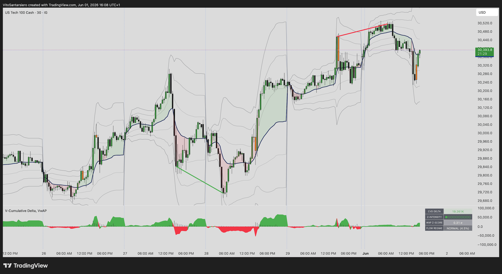
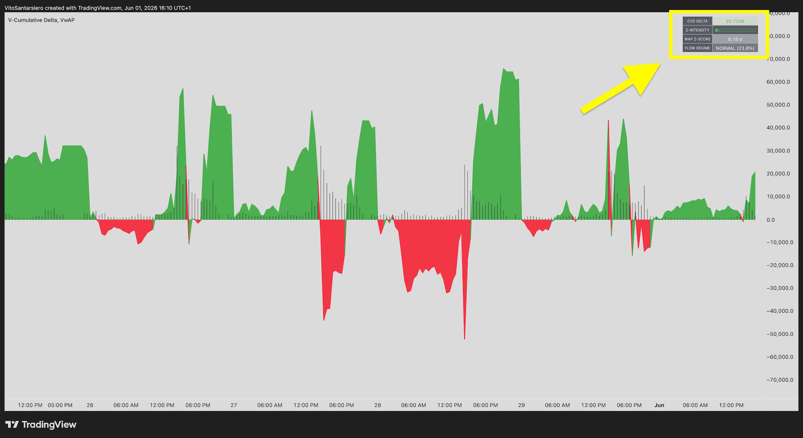
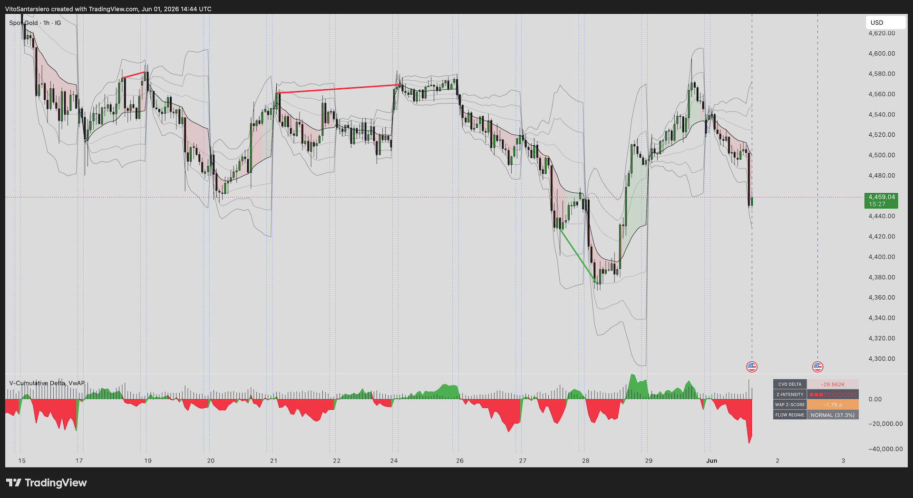

# V-Cumulative Delta

**Pine Script v6 | TradingView | Institutional Order Flow Analysis**

Proprietary CVD engine combining cumulative volume delta tracking with anchored VWAP, multi-mode divergence detection, and institutional flow regime classification. Part of the V-Suite.

---

## ⚠️ Proprietary Notice

The source code of this indicator is **proprietary and not publicly released**. This repository serves as a public showcase of the engine's capabilities and architecture. **Live screen-share demo available upon request** via [LinkedIn](https://linkedin.com/in/vito-santarsiero).

---

## What it does

V-Cumulative Delta tracks the net difference between buying and selling pressure in real time, anchored to a configurable reset timeframe. The engine answers one question: **who is in control of the market, and how aggressively?**

The indicator combines four analytical layers:

**Cumulative Delta Tracking**
- Three operating modes: Reset (per session or timeframe), Single (raw bar delta), Continuous (cumulative since chart start)
- Lower-timeframe volume aggregation for granular order flow precision
- Auto-adaptive intrabar resolution based on chart timeframe

**Anchored VWAP with Standard Deviation Bands**
- VWAP reset by Session, Week, Month, Quarter or Year
- Three configurable standard deviation bands defining statistical exhaustion zones
- Automatic chart-vs-anchor timeframe consistency check

**Divergence Detection Engine**
- Configurable scan: Regular only, or All (Regular + Hidden) divergences between price and CVD
- Early-warning signals for momentum exhaustion and reversal setups

**Institutional Flow Regime Classification**
- Real-time classification into three regimes based on delta efficiency and CVD Z-Score:
  - **ICEBERG** — Hidden absorption: heavy delta with minimal price reaction
  - **EXHAUST** — Trend exhaustion: low delta efficiency despite elevated CVD activity
  - **NORMAL** — Standard order flow conditions
- Advanced dashboard with Z-Score intensity metrics and active regime state
- Volume Shock Bar detection: highlights bars where price diverges aggressively from VWAP under statistically elevated volume (adaptive Z-Score filter + ATR range validation)

---

## Screenshots

### Overview — Cumulative Delta with Anchored VWAP (Spot Gold 1h)
Full system view: VWAP and standard deviation bands on price, V-Cumulative Delta oscillator below, divergences automatically annotated. Dashboard shows WAP Z-Score in elevated state (-1.75σ).

---

### Dashboard Close-Up — Institutional Metrics
Zoom on the V-Cumulative Delta oscillator and live metrics dashboard: CVD Delta, Z-Intensity bars, WAP Z-Score, and real-time Flow Regime classification.

---

### Divergence Detection (Nasdaq 30m)
Multi-divergence example: bearish divergence at top with subsequent price exhaustion, bullish divergence at swing low. Orange shock bar highlights statistically elevated volume activity.

---

## Live Demo

Screen-share demo on TradingView available on request. Reach out via [LinkedIn](https://linkedin.com/in/vito-santarsiero) or email.

---

## Part of the V-Suite

This indicator complements the broader V-Suite for TradingView:

- **[V-SUITE for TradingView](https://github.com/VTS92/V-SUITE-for-TradingView)** — Integrated Pine Script library (V-WAPE, V-Profile Matrix)
- **[V-Sessions Engine](https://github.com/VTS92/V-SESSIONS-Multi-Timezone-State-Management-Engine-for-TradingView)** — Multi-timezone session engine with intra-session volume profile, anchored VWAP and persistent liquidity tracking

Used together: **V-Cumulative Delta** identifies *who* is in control · **V-WAPE** identifies *when* aggressive moves occur · **V-Profile Matrix** identifies *where* institutions were active · **V-Sessions** anchors all of this to global market session boundaries.

---

## Author

**Vito Santarsiero** — Trading Platform Operations Specialist | CISI IOC Candidate | London, UK

[LinkedIn](https://linkedin.com/in/vito-santarsiero) · [GitHub](https://github.com/VTS92)
